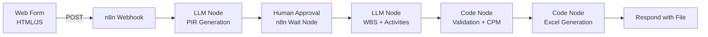
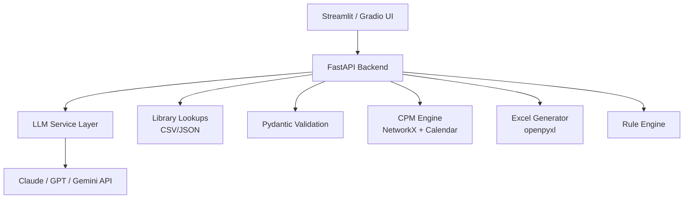
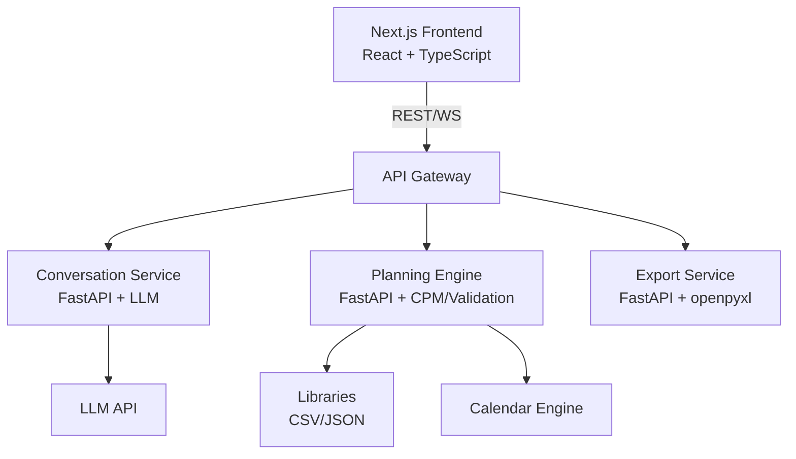

# Construction Planning Agent — App Architecture Analysis

**Based on:** `construction_planning_agent_final_plan.md` (v1.0, 3 May 2026)

---

## What the Plan Describes

The agent is an **LLM-powered construction planner's assistant** that converts a brief project description into an auditable, editable, preliminary planning package (AACE Class 5/4). Key characteristics:

| Dimension | Summary |
|---|---|
| **Core workflow** | Brief → Conversational PIR → Planning Basis approval → WBS/activities → CPM → Excel package |
| **Human-in-the-loop** | Two mandatory approval gates (Planning Basis, Draft Schedule) — not autonomous |
| **LLM role** | Interpretive/narrative only — no calculations, no inventing rates |
| **Code role** | Schema validation (Pydantic), CPM, calendar arithmetic, rule engine, Excel generation |
| **Knowledge** | Static CSV/JSON libraries (production rates, logic rules, lead times, calendars, typologies) |
| **Output** | 8-tab professional Excel workbook + narrative reports |
| **Orchestration** | Plan mentions n8n explicitly (§21.2) |
| **Phase 1 timeline** | 14 weeks (1a: foundation, 1b: CPM, 1c: calibration) |

---

## Three Viable Architecture Approaches

### Option A — n8n + Lightweight Web Frontend

This follows the plan's own recommendation (§21.2). n8n handles workflow orchestration; a simple web form captures user input.



| Pros | Cons |
|---|---|
| Directly matches §21.2 of the plan | n8n Code Nodes have limited Python support (JS-native); complex CPM/Pydantic/openpyxl logic would need an external Python service anyway |
| Low-code orchestration — fast to prototype | Conversational PIR (§4.1 — progressive, multi-turn) is awkward in n8n's linear workflow model |
| Visual workflow editing for non-developers | Human-in-the-loop approval gates are basic (email-based wait nodes) — not a rich UX |
| Self-hosted or cloud | Scaling and state management for multi-turn conversations is limited |

**Verdict:** Good for a quick PoC, but the conversational PIR and rich approval UX will outgrow n8n quickly. You'd end up building a custom frontend anyway.

---

### Option B — Full-Stack Python (FastAPI + Streamlit or Gradio)

A monolithic Python application. FastAPI serves the backend; Streamlit or Gradio provides the UI. All libraries (Pydantic, pandas, openpyxl, NetworkX) run natively.



| Pros | Cons |
|---|---|
| **All recommended libraries run natively** (Pydantic, pandas, NetworkX, openpyxl, python-dateutil) — no language translation | Streamlit/Gradio UIs look functional but not premium — limited control over UX polish |
| Conversational PIR maps naturally to Streamlit's chat interface | Streamlit's session-state model can be tricky for complex multi-step workflows |
| Single language, single deployment | Scaling beyond a single user requires more infrastructure work |
| Fastest path to a working Phase 1a | May need to rebuild frontend later if you want a public-facing product |
| Easy to deploy (Docker, Fly.io, Railway) | |

**Verdict:** Best fit for Phase 1a (weeks 1–6) and calibration (Phase 1c). Gets a working tool in planners' hands fastest. The Streamlit chat interface handles the conversational PIR naturally.

---

### Option C — Next.js Frontend + Python Microservices

A production-grade, decoupled architecture. React/Next.js frontend for a polished UI; Python microservices for the computational backend.



| Pros | Cons |
|---|---|
| Premium, polished UI — full control over conversational PIR UX | Significantly more development effort — 2–3× the timeline |
| Best for multi-user, team-based workflows | Requires JS + Python expertise |
| Clean separation: LLM orchestration vs computation vs presentation | Over-engineered for Phase 1 validation |
| Scales to a commercial product | Need to solve deployment for two language runtimes |
| Real-time updates via WebSockets for long CPM runs | |

**Verdict:** The right architecture for Phase 2+ if the tool proves its value with planners. Premature for Phase 1.

---

## Recommendation

> [!IMPORTANT]
> **Start with Option B (FastAPI + Streamlit), plan migration to Option C after Phase 1c calibration confirms product-market fit.**

### Why

1. **The plan's own priorities are clear**: Phase 1 is about getting the core logic right (PIR, production-rate durations, CPM, validation rules, Excel output) and calibrating against real projects. UI polish is not the bottleneck — planning logic is.

2. **Every recommended library** (§22) — Pydantic, pandas, openpyxl, NetworkX, python-dateutil, Plotly — is Python-native. Fighting a language boundary in Phase 1 wastes time.

3. **The conversational PIR** (§4.1) maps directly to Streamlit's `st.chat_message` / `st.chat_input` components. Progressive disclosure, structured inputs (dropdowns, sliders, radio buttons), and "why this default?" explanations are all native Streamlit capabilities.

4. **Human-in-the-loop gates** (§13.1) — Planning Basis Approval and Draft Schedule Review — are naturally represented as Streamlit pages/steps with explicit "Approve" buttons.

5. **Calibration (Phase 1c)** requires running the agent against 5–8 historical projects and measuring edit rates, duration accuracy, and planner satisfaction. A lightweight Streamlit app is ideal for this — you can iterate rapidly based on planner feedback.

6. **n8n** (Option A) is fine for linear workflows but struggles with the multi-turn conversational PIR and rich structured inputs. You'd end up building custom nodes that replicate what FastAPI already does.

---

## Proposed Phase 1a Build Plan (Weeks 1–6)

### Project Structure

```
Agent-PM/
├── app/
│   ├── main.py                  # Streamlit entry point
│   ├── pages/
│   │   ├── 01_project_brief.py  # Initial brief input
│   │   ├── 02_pir.py            # Conversational PIR
│   │   ├── 03_planning_basis.py # Planning Basis Summary + approval gate
│   │   ├── 04_schedule.py       # WBS + activities + draft review
│   │   └── 05_export.py         # Excel download + validation report
│   └── components/
│       ├── chat.py              # Reusable chat components
│       └── approval_gate.py     # Human approval UI
├── core/
│   ├── models.py                # Pydantic schemas (Activity, WBS, etc.)
│   ├── llm_service.py           # LLM API calls (PIR, WBS, narratives)
│   ├── cpm_engine.py            # Calendar-aware CPM (NetworkX)
│   ├── calendar_engine.py       # Working calendars, holidays, RDOs
│   ├── validation_engine.py     # Construction-logic rules
│   ├── procurement.py           # Procurement chain logic
│   └── excel_export.py          # 8-tab workbook generation (openpyxl)
├── libraries/
│   ├── production_rates.csv     # §9.2 production-rate library
│   ├── construction_logic.csv   # §9.2 construction-logic rules
│   ├── procurement_leads.csv    # §9.2 procurement lead times
│   ├── calendars.json           # §9.2 calendar library
│   ├── typologies.json          # §9.2 building typology library
│   └── wbs_templates.json       # §9.2 WBS template library
├── tests/
│   ├── test_cpm.py
│   ├── test_validation.py
│   ├── test_calendar.py
│   └── test_models.py
├── requirements.txt
├── Dockerfile
└── README.md
```

### Week-by-Week Breakdown

| Week | Deliverable |
|---|---|
| **1** | Pydantic schemas (Activity, WBS, Project), static library CSVs (production rates, logic rules, lead times), calendar engine (VIC_5DAY_STANDARD_2026) |
| **2** | LLM service layer (PIR generation, project interpretation), Streamlit brief input page + conversational PIR page |
| **3** | WBS + activity generation (library-grounded), procurement chain generation, Planning Basis Summary page + approval gate |
| **4** | Validation engine (10–12 core construction rules), draft schedule review page with edit capability |
| **5** | Calendar-aware CPM engine (forward/backward pass, float, critical path), three-point durations → P50/P80 |
| **6** | 8-tab Excel workbook generation, Basis of Schedule narrative, Planner Sign-Off section, integration testing |

### Key Technical Decisions

| Decision | Recommendation | Rationale |
|---|---|---|
| **LLM API** | Claude (Anthropic) | Best at structured JSON output; model tiering per §21.3 (Opus for interpretation, Sonnet for WBS, Haiku for re-prompts) |
| **State management** | Streamlit `st.session_state` + JSON file persistence | Simple for single-user Phase 1; migrate to PostgreSQL for multi-user |
| **CPM implementation** | Custom Python on NetworkX DAG | Full control over calendar-aware forward/backward pass; no suitable off-the-shelf Python CPM library handles construction calendars |
| **Deployment** | Docker → Fly.io or Railway | Single-command deployment; free tier sufficient for calibration |

---

## Migration Path to Option C (Post Phase 1c)

If calibration confirms the tool is useful (edit rate < 30%, planner satisfaction > 7/10):

1. Extract `core/` into a standalone FastAPI service (the Pydantic models and engines are already decoupled).
2. Build a Next.js frontend with a polished conversational UI, structured form inputs, and real-time schedule visualization.
3. Add PostgreSQL for multi-user state, project versioning (§24), and audit trails.
4. Add WebSocket support for long-running CPM calculations.
5. Add authentication and team-based access.

The key insight is that the `core/` package is **framework-agnostic** — it doesn't care whether it's called from Streamlit, FastAPI, or n8n. Building it cleanly in Phase 1 makes the migration straightforward.

---

## Open Questions for Your Decision

1. **LLM provider preference?** The plan mentions OpenAI, Gemini, and Claude (§22). Claude is recommended for structured output quality, but if you have existing API access or institutional agreements, that may override.

2. **Hosting constraints?** University IT policies may restrict cloud deployment. If self-hosted is required, Docker + a VM is the simplest path.

3. **Teaching vs research use?** If this is primarily for ABPL90331 teaching, a Streamlit app that students can interact with is ideal. If it's for a research publication (§26.3), you may want the n8n version for reproducibility/methodology description.

4. **Who curates the initial libraries?** The production-rate and construction-logic libraries (§9) are the agent's knowledge backbone. Do you have existing data, or should we start from publicly available sources (Rawlinsons, Cordell)?

5. **Would you like me to start building Phase 1a now?** I can begin with the Pydantic schemas, calendar engine, and project structure immediately.
